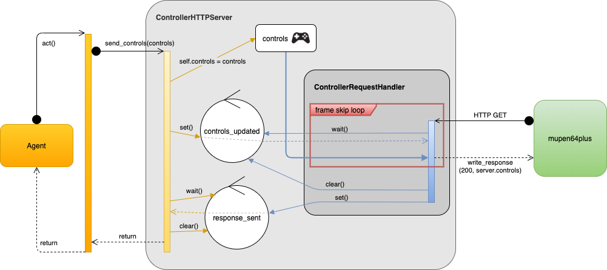

# Thread Synchronization
Since both the agent and the emulator are operating independently and both running their own loops (agent-env loop; game loop), both also trigger calls within the gym environment. These independent calls need to be synchronized so the loops can be aligned and operate deterministically together. The agent should be able to trigger a step in the environment, and the emulator should be able to trigger a step/frame in the game, but both of these steps should act as one. This is handled inside the gym environment's HTTP server, responsible for updating the controller data, by use of Python's threading.Event objects.

Below are three diagrams depicting the same implementation & behavior, but in three different ways. The next two sections describe this behavior in words, but the images below should help to provide additional clarity.

## Agent-Env Loop
The agent-env loop calls the `act()` method on the environment, providing the action (controls) to be used. This call invokes the `send_controls()` method on the `ControllerHTTPServer` class, which updates its internal controls object. The call then sets the `controls_updated` event and waits for the `response_sent` event. After being notified of that event, it clears the event and the call finally returns.

## Emulator Game Loop
The emulator is running a game loop internally. Each frame of emulation polls the controller for its state. This project is using the `mupen64plus-input-bot` input plugin, which makes an HTTP GET call to retrieve this controller state. Inside the environment, the `ControllerHTTPServer` is listening for these requests, and dispatching them to the `ControllerRequestHandler` nested class. When a GET request is received, the handler waits for the `controls_updated` event. Once notified of this event, it writes the HTTP response (200 OK status and the JSON-serialized controls object). If the `frame_skip` is enabled and the number of responses sent is less than this value, the call returns. After receiving and responding to the appropriate number of requests to meet the frame skip configuration, the method clears the `controls_updated` event and sets the `response_sent` event.

## Thread Synchronization Object Diagram

## Thread Synchronization Sequence Diagram (A)
[")](./threadSyncSeqDiagramA.png)

## Thread Synchronization Sequence Diagram (B)
[")](./threadSyncSeqDiagramB.png)
