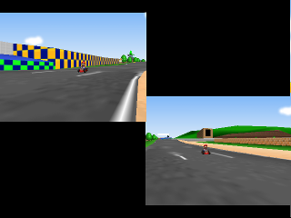

# MarioKart64 Environment

This page describes the MarioKart64 environment(s).

## Configuration

A configuration file ([`mario_kart_config.yml`](mario_kart_config.yml)) has been provided for this game.

The first configuration setting is `ROM_NAME`. This setting must specify the name of the MarioKart64 ROM file (which should be placed in `./gym_mupen64plus/ROMs/`). The default configuration value is `marioKart.n64`.

The second setting is an override of the base config for the video plugin `GFX_PLUGIN`, which has been set to `mupen64plus-video-glide64`. It has been observed that this plugin outperforms the default `mupen64plus-video-rice` plugin for this game (at least on my system). This value can be removed to revert to the default in the base config.

### A note on the ROM file:
As mentioned on the top page, links to ROM files will not be provided here. However, because some people have encountered errors with certain ROMs, it is worth mentioning that we used a MarioKart64 ROM with an MD5 checksum of `e19398a0fd1cc12df64fca7fbcaa82cc`.

A couple ways to check the MD5 sum:
- Online checksum tool available [here](http://emn178.github.io/online-tools/md5_checksum.html)
- Command line:
    ```sh
    # MacOS:
    md5 marioKart.n64

    # Unix/Linux:
    md5sum marioKart.n64
    ```

Sample emulator output for an invalid ROM file (see [issue #77](https://github.com/bzier/gym-mupen64plus/issues/77) for more details):
```
...
Core Error: open_rom(): not a valid ROM image
UI-Console Error: core failed to open ROM image file '/src/gym-mupen64plus/gym_mupen64plus/ROMs/marioKart.n64'.
Changed back to DISPLAY :0
Emulator closed with code: 10
```

## Implementation Details

### `MarioKartEnv`:

#### Methods:

* Implementation of base abstract methods:
    * `_navigate_menu()` moves through the game menu from startup to the beginning of an episode.

        This method sends `NOOP` to the controller server except in the following frames:
        
        * 10: Nintendo screen - Press 'A'
        * 80: Mario Kart splash screen - Press 'A'
        * 120: Select number of players - Press 'A'
        * 125: Select GrandPrix or TimeTrials - Joystick Down
        * 130: Select TimeTrials - Press 'A'
        * 132: Select Begin - Press 'A'
        * 134: OK - Press 'A'
        * 150-156: Move to the correct player
        * 160: Select player - Press 'A'
        * 162: OK - Press 'A'
        * 195-202: Move to the correct map series
        * 202: Select map series - Press 'A'
        * 223-230: Move to the correct map choice
        * 230: Select map choice - Press 'A'
        * 232: OK - Press 'A'
        
        
        At frame 284, the level is fully loaded and ready to go.

    * `_get_reward()` determines the reward for each step.
        * Typically each step rewards `-1`
        * At the change of each lap, rewards `100`
        * At the end of the race, rewards `1000` plus `215` (*to account for delay of 215 steps in detecting the end of the race*)

        *Checkpoint rewards*:
        
        There are also environment options to allow checkpoint rewards. As the character progresses, a colored line is drawn around the edge of the screen. This line is drawn in one of three colors that designates the current lap (lap 1 - blue, lap 2 - yellow, lap 3 - red). The checkpoint reward system samples designated points on the HUD around the edges and detects progress using the pixel colors. As those designated checkpoints are reached and detected, a reward of `100` is given.

        * The checkpoints are tracked per lap and can only be achieved once per lap

          > This prevents an agent from learning to do doughnuts over a checkpoint. 

        * The game will also un-draw the colored lines when the character drives backwards. The checkpoint reward system detects this and gives a reward of `-??`. This discourages backward movement by an AI agent.

        [](screenshots/hud_progress.png)


    * `_evaluate_end_state()` determines whether or not the episode is over.
    
        At the end of each race, the game shrinks the view to multiple smaller frames in order to show lap/race times. We sample the corners of the screen, and if the pixels in all four corners are the same color for 30 frames in a row, we consider it the end of the race (episode).

        [](screenshots/end_episode_1.png)
        [](screenshots/end_episode_2.png)

    * `_reset()` resets the environment to begin a new episode.

        If the environment is at the end of an episode, `reset()` will navigate the post-race menu to retry the course (see `_navigate_post_race_menu()` below). If the environment is not at the end of an episode (i.e. still mid-race), it will pause the game and navigate the menu to retry the course. Other scenarios still need to be implemented (e.g. future support for random characters/courses would need to navigate through different menu options).


* Additional class methods:
    * `_navigate_post_race_menu()` called by `reset()`

        This method sends `NOOP` to the controller server except in the following frames:
        * 60: Result times screen - Press 'A'
        * 75: Post-race menu (retry selected) - Press 'A'

        At frame 138, the level is fully loaded and ready to go.

    * `_set_character(character)` returns the row and column of the specified character.
        * `mario`
        * `luigi`
        * `peach`
        * `toad`
        * `yoshi`
        * `d.k.`
        * `wario`
        * `bowser`

    * `_get_lap()` returns the current lap number. This method evaluates the color of the pixel at `(203, 50)`. This point is constant throughout the race and is indicative of the current lap. The color map is stored in `LAP_COLOR_MAP`.


### `track_envs.py`:

This file contains definitions for subclasses of `MarioKartEnv` which provide environments for each of the 16 available tracks/courses. These classes simply set the value of the `MAP_SERIES` and `MAP_CHOICE` constants.

### Action Space:
The default environments use the existing base class provided action space (see the [initialization](../../../docs/architecture.md#initialization) section of the architecture doc for details). However, there are also discrete versions of these environments as well (as of 2017.11.10, only Luigi Raceway has been added). This is well-suited for AI agents that are designed to produce a [1-hot](https://machinelearningmastery.com/how-to-one-hot-encode-sequence-data-in-python/) type output. It allows the agent to pick the 'appropriate' action from a set rather than directly outputting the controller state. The discrete action space provides the following 12 options:
* NO_OP
* Straight
* Brake
* Back-up
* Soft left
* Left
* Hard left
* Extreme left
* Soft right
* Right
* Hard right
* Extreme right

For the definitions of these actions, see `discrete_envs.py`


